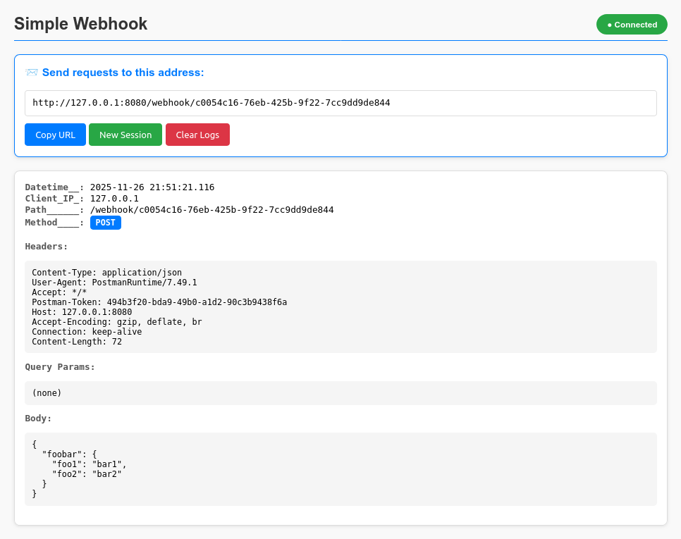

# Simple Webhook

**Simple Webhook** adalah aplikasi Python ringan untuk menerima, menampilkan, dan memantau webhook secara realtime menggunakan **Flask + SSE (Server-Sent Events)**.
Aplikasi ini mendukung **multi-session**, sehingga setiap pengguna memiliki URL webhook terpisah dan log yang tidak tercampur.




---

## Fitur Utama

* Menerima semua jenis HTTP request (GET, POST, PUT, PATCH, DELETE, OPTIONS)
* Viewer realtime menggunakan SSE (tanpa refresh)
* Multi-session (setiap user punya session sendiri)
* Mendukung JSON, form-urlencode, raw body, dan file upload
* Query-string & header ditampilkan lengkap
* UI otomatis refresh log terbaru
* Endpoint health check

---

## Persiapan

* Python 3.8+
* Flask

Install dependency:

```bash
pip install flask
```

Atau jika menggunakan virtual environment:

```bash
python3 -m venv env
source env/bin/activate
pip install flask
```

---

## Cara Menjalankan

Jalankan aplikasi:

```bash
./env/bin/python3 simple_webhook.py
```

Contoh output:

```
============================================================
🚀 Simple Webhook
============================================================

📍 Viewer : http://0.0.0.0:8080
📨 Webhook: http://0.0.0.0:8080/webhook/YOUR_SESSION_ID
💚 Health check: http://0.0.0.0:8080/health

============================================================
```

Aplikasi akan hidup di:

```
http://localhost:8080
```

---

## URL Penting

| Fitur                | URL                                          |
| -------------------- | -------------------------------------------- |
| **Viewer**           | `http://localhost:8080`                      |
| **Webhook Receiver** | `http://localhost:8080/webhook/<SESSION_ID>` |
| **Health Check**     | `http://localhost:8080/health`               |

Viewer akan otomatis membuat **session_id** baru jika belum ada.

---

## Contoh Penggunaan

### 1. Kirim JSON

```bash
curl -X POST \
  -H "Content-Type: application/json" \
  -d '{"hello": "world"}' \
  http://localhost:8080/webhook/<SESSION_ID>
```

### 2. Kirim Form Data

```bash
curl -X POST \
  -d "username=admin&password=1234" \
  http://localhost:8080/webhook/<SESSION_ID>
```

### 3. Upload File

```bash
curl -X POST \
  -F "file=@/etc/hosts" \
  http://localhost:8080/webhook/<SESSION_ID>
```

### 4. Kirim Query Param

```
http://localhost:8080/webhook/<SESSION_ID>?id=123&token=abc
```

Semua data akan tampil realtime di viewer tanpa reload.

---

## Lisensi

Bebas digunakan untuk keperluan pribadi maupun proyek Anda.

